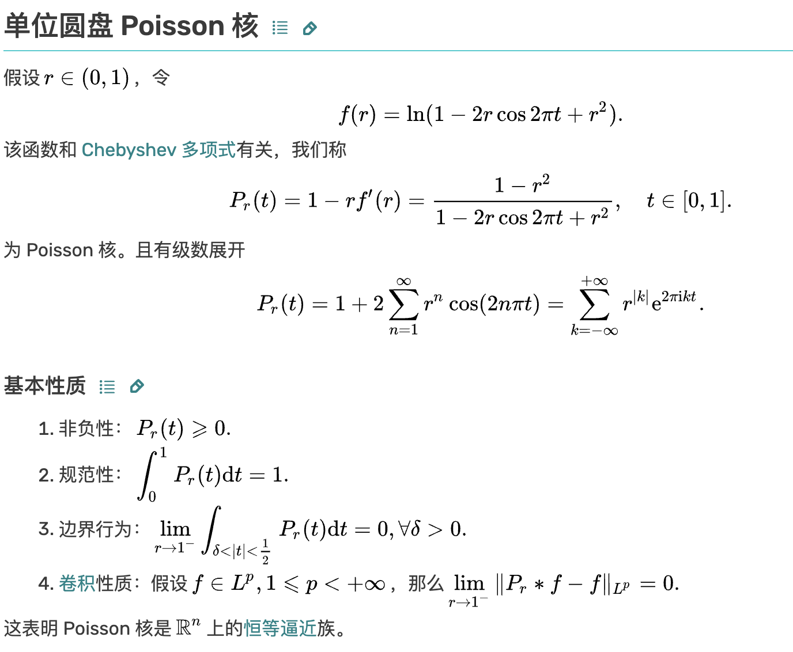

# 1. Infinitely dilute limit and dipole
For a isolated dielectric sphere, with conductivity $\sigma_1$ and radius $a$. And the conductivity of the background is $\sigma_0$.

Then the charge density $\rho$ on the surface of the sphere is:
$$
\rho = 2\lambda \cos(\theta),~\lambda = \frac{\sigma_1 - \sigma_0}{\sigma_1 + \sigma_0}
$$

Then the dipole moment is:
$$
p_1 = \int_0^{2\pi} (ad\theta 2\lambda \cos(\theta)) a\cos(\theta) = 2\pi a^2 \lambda\\
p_2 = 0
$$

The Green's function is $$G(X,X') = \frac{1}{2\pi} \ln|X-X'|$$

Consider the potential is:
$$
\phi(X_0) = \int G(X_0,X)\rho(X)dX\\
\approx \int G(X_0,0)\rho(X)dX + \int \nabla_2 G(X_0,0)X\rho(X)dX\\
= Q + \nabla_2 G(X_0,0)p
$$

Plug in the dipole moment, we get:
$$
\phi(X_0) = 0 + \frac{\cos(\theta)}{2\pi r}p_1 = \frac{a^2\lambda\cos(\theta)}{r}
$$

# 2. Potential normal derivative juming on the surface of a dielectric sphere
-(7).png)
$G(P,Q)$ is the Green's function:
$$G(P,Q) = \begin{cases} \frac{1}{s_d}\ln|P-Q|,~d=2\\
\frac{1}{s_d}\frac{1}{|P-Q|^{d-2}},~d\geq3\end{cases}$$

$s_d$ is the surface area of the unit sphere in $\mathbb{R}^d$.

If we can prove that: for a bounded simple-connected area $D$ in $\mathbb{R}^d$ with smooth surface $\partial D$ and charge density $\rho$, we have a jumping relation:
$$\frac{\partial u_{\text{out}}}{\partial n}(P) = \text{p.v.}\int_{\partial{D}}\frac{\partial G(P,Q)}{\partial n}\rho(Q)ds+\frac{1}{2}\rho(P)\\\frac{\partial u_{\text{in}}}{\partial n}(P) = \text{p.v.}\int_{\partial{D}}\frac{\partial G(P,Q)}{\partial n}\rho(Q)ds-\frac{1}{2}\rho(P)\\ \forall P \in \partial D$$

Then combined with $\sigma_{\text{out}}u_{\text{out}}(P) = \sigma_{\text{in}}u_{\text{in}}(P)$ we can easily prove above formul translation.

When $d=2$ and $D$ is a disk, to prove the jumping relation is to solve:

$$\rho(x)\in C[0,2\pi],~\rho(0)=\rho(2\pi)\\f(t) = \int_0^{2\pi}\ln(t^2+1-2t\cos(\theta))\rho(\theta)d\theta\\\text{solve}:f'(1)$$

With the properties of poisson kernel it's easy.

---
A more general result and proof refers to *Kress, Rainer. Linear Integral Equations. 卷 82. Applied Mathematical Sciences. New York, NY: Springer New York, 2014. https://doi.org/10.1007/978-1-4614-9593-2.* Th 6.18, 6.19

# 3. Rayleigh’s method

Purpose: deduce (9):
### (0) Denatation
Denote
$$P = z_j+a e^{i\theta} \\ Q = z_m+a e^{i\phi}$$

### (1) Complex representation
$$\frac{\partial G}{\partial}(P,Q) = \frac{1}{2\pi} Re(\frac{e^{i\theta}}{P-Q})$$

### (2) Fourier expansion of 2 variables
$$\frac{1}{P-Q} = \frac{1}{z_j-z_m+a(e^{i\theta}-e^{i\phi})}$$

Disks non-insert $\Longrightarrow |z_j-z_m|>2a$
$$=\frac{1}{z_j-z_m}\frac{1}{1+\frac{a(e^{i\theta}-e^{i\phi})}{z_j-z_m}}$$

$$=\frac{1}{z_j-z_m}\sum_{n=0}^{\infty}(-1)^n(\frac{a}{z_j-z_m})^n(e^{i\theta}-e^{i\phi})^n$$

$$=\frac{1}{z_j-z_m}\sum_{n=0}^{\infty}(-1)^n(\frac{a}{z_j-z_m})^n\sum_{p=0}^n\binom{n}{p}e^{ip\phi}(-1)^pe^{i\theta(n-p)}$$

$$=\sum_{n=0}^{\infty}\sum_{p=0}^n\frac{1}{a}(-1)^{n+p}\binom{n}{p}(\frac{a}{z_j-z_m})^{n+1}e^{ip\phi}e^{i\theta(n-p)}$$

Rearrange by $k=n-p+1,l=p$
$$=\sum_{k=1}^{\infty}\sum_{l=0}^{\infty}\frac{1}{a}(-1)^{k-1}\binom{k+l-1}{l}(\frac{a}{z_j-z_m})^{k+l}e^{il\phi}e^{i\theta(k-1)}$$

### (3) Fourier expansion of charge density
$$\rho(\theta) = \sum_{k=1}^{\infty}a_m(k)\cos(k\theta)+b_m(k)\theta$$

$$=Re\left[\sum_{k=1}^{\infty}(a_m(k)-ib_m(k))e^{ik\theta}\right]$$

$$\Longrightarrow A_m(k)=a_m(k)+ib_m(k)$$

$$\Longrightarrow \int_0^{2\pi}\rho(\theta)e^{ik\theta}d\theta=\pi(a_m(k)+ib_m(k))=\pi\overline{A_m(k)}$$

### (4) 
$$\forall m\neq j, \int_{\partial D_m}\frac{\partial G(P,Q)}{\partial n}\rho_m(Q)ds$$

$$=\int_0^{2\pi}\frac{1}{2\pi}Re\left[\frac{e^{i\theta}}{P-Q}\rho_m(\phi)\right]ad\phi$$

$$=\frac{1}{2\pi}Re\left[\sum_{k=1}^{\infty}\sum_{l=0}^{\infty}(-1)^{k-1}\binom{k+l-1}{l}(\frac{a}{z_j-z_m})^{k+l}e^{i\theta k}\int_0^{2\pi}\rho_m(\phi)e^{il\phi}d\phi\right]$$

$$=\frac{1}{2}Re\left[\sum_{k=1}^{\infty}\sum_{l=1}^{\infty}(-1)^{k-1}\binom{k+l-1}{l}(\frac{a}{z_j-z_m})^{k+l}\overline{A_m(l)}e^{i\theta k}\right]$$

### (5)
For the original formula:
$$Re\left[2\lambda_j e^{i\theta}\right]=Re\left[\sum_{k=1}^{\infty}A_j(k)e^{ik\theta}+\lambda_j\sum_{k=1}^{\infty}\left[(-1)^k\sum_{m\neq j}^M\sum_{l=1}^{\infty}\binom{k+l-1}{l}(\frac{a}{z_j-z_m})^{k+l}\overline{A_m(l)}\right]e^{i\theta k}\right]$$

$$\Longrightarrow A_j(k)+(-1)^k\lambda_j\sum_{m\neq j}^M\sum_{l=1}^{\infty}\binom{k+l-1}{l}(\frac{a}{z_j-z_m})^{k+l}\overline{A_m(l)} = \begin{cases} 2\lambda_j,~k=1\\0,~k>1\end{cases}$$